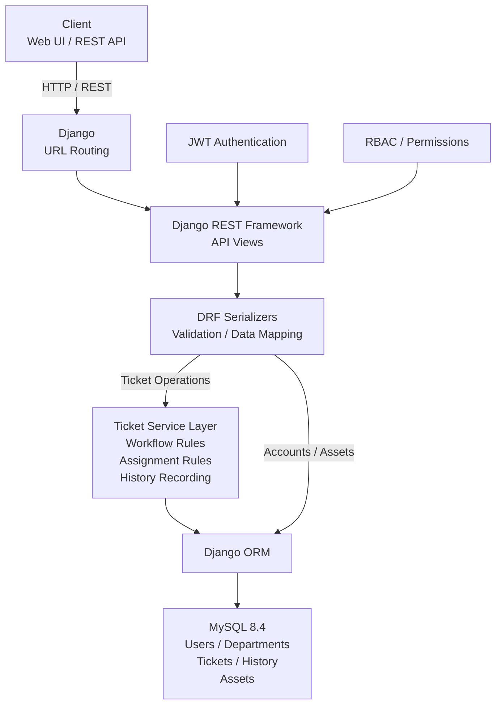
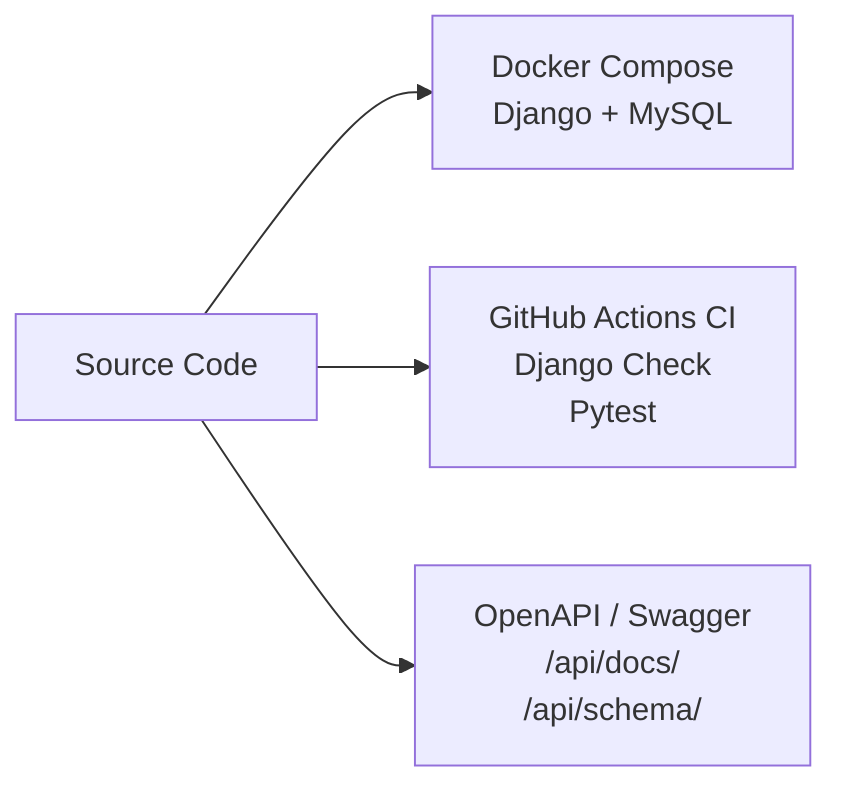

# System Architecture

## Overview

The Enterprise IT Service Desk Platform is built with Django and Django REST Framework using a layered backend architecture.

The system separates HTTP request handling, authentication and authorization, data validation, business rules, and database persistence.

## Architecture Diagram



## Engineering Infrastructure



## Application Layers

### API Layer

Django REST Framework API views handle incoming HTTP requests and API responses.

JWT authentication verifies the identity of API users, while role-based permissions control access according to the user's system role.

### Serialization and Validation Layer

DRF serializers handle request validation, data transformation, and API representation.

### Service Layer

Ticket business rules are separated from API views through the ticket service layer.

Responsibilities include:

- Ticket creation
- Ticket assignment and reassignment
- Ticket workflow validation
- Resolution rules
- Ticket history recording

The current service layer primarily handles ticket-domain business logic. Accounts and asset operations interact with the persistence layer through their respective Django and DRF components.

### Persistence Layer

Django ORM provides the persistence layer between the application and MySQL.

The primary domain data includes:

- Users
- Departments
- Tickets
- Ticket history
- Assets

## Infrastructure

### Docker

Docker Compose provides containers for:

- Django application
- MySQL database

A persistent Docker volume is used for MySQL data.

### Continuous Integration

GitHub Actions automatically validates pushes and pull requests to the `master` branch.

The CI pipeline performs:

- Python environment setup
- MySQL service startup
- Dependency installation
- Django system check
- Complete Pytest test suite

The current automated test suite contains 40 tests covering ticket APIs, RBAC, ticket workflow rules, ticket history, dashboard permissions, and asset management behavior.

### API Documentation

OpenAPI documentation is generated with drf-spectacular.

Swagger UI is available at:

```text
/api/docs/
```

The OpenAPI schema is available at:

```text
/api/schema/
```